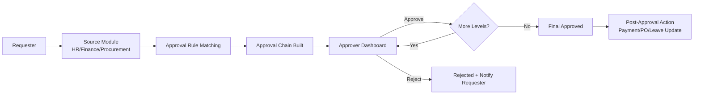
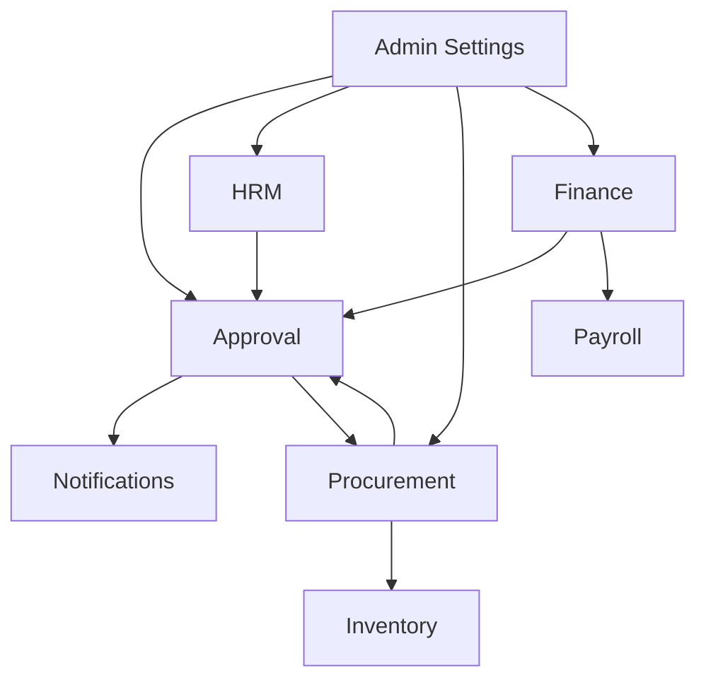
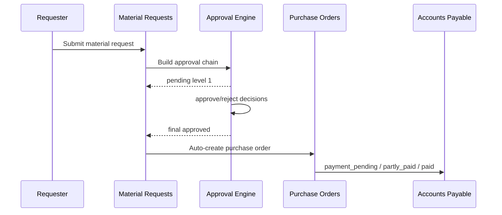

# Steps CRM

Enterprise resource management platform built with React, Express, and MongoDB.

## Overview

Steps CRM combines operations across HR, procurement, finance, payroll, inventory, maintenance, security, analytics, and admin controls in one system.

Current implementation highlights:

- Multi-module workspace with role-based access
- Approval workflow engine with configurable multi-level routing
- Material request to purchase order lifecycle support
- Direct purchase order creation and approval controls
- Accounts payable tracking including partial and full payment flow
- Notification center and activity timelines
- Audit-oriented admin capabilities

## Core Modules

- HRM: employees, departments, job titles, leave allocations, leave and travel requests
- Finance: invoicing, accounts payable, advance and refund requests
- Procurement: material requests, purchase orders, vendor management, stock-linked fulfillment
- Inventory: item management, stock movements, internal transfers, issues
- Payroll: payroll run management and related workflows
- Attendance: attendance records and external attendance integration fallback
- Security: physical security logs, visitor sign-in, security settings
- Admin: module setup, users, roles, approval settings, backups, system settings
- Analytics and Reporting: consolidated operational dashboards and generated reports

## Approval Workflow (Current Routing)

Approval rules are defined in the approval settings area and stored in the ApprovalRule model.

High-level flow:

1. Request is submitted from a source module (for example Material Requests, Leave Requests, Advance Requests).
2. Server matches an active rule for that module and condition set.
3. Server builds an approvalChain with level-based approvers.
4. Current approver sees the request as pending.
5. Approve action advances to next level or finalizes request.
6. Reject action stops the chain and marks request rejected.

Notable behavior in procurement:

- Material request final approval can trigger purchase order creation.
- Purchase orders also support their own approval chain and status progression.

## Tech Stack

Frontend:

- React (Vite)
- React Router
- Tailwind CSS
- Axios-based API service
- React Hot Toast
- Recharts

Backend:

- Node.js and Express
- MongoDB with Mongoose
- JWT auth middleware
- Multer for uploads

## Project Structure

```text
StepsProject/
   public/
   server/
      index.js
      api.js
      middleware/
      models/
      routes/
      utils/
      uploads/
   src/
      App.jsx
      main.jsx
      components/
         auth/
         common/
         modules/
      context/
      services/
      home/
      utils/
   package.json
   vite.config.js
   tailwind.config.js
   vercel.json
```

## Local Setup

Prerequisites:

- Node.js 18+
- npm
- MongoDB (local or Atlas)

1. Install dependencies in root and server:

```bash
npm install
cd server
npm install
cd ..
```

2. Create root .env:

```env
VITE_API_BASE_URL=http://localhost:4000
```

3. Create server/.env:

```env
MONGODB_URI=mongodb://localhost:27017/steps-crm
JWT_SECRET=change_me
PORT=4000
INVENTORY_EXPIRY_ALERT_DAYS=30
INVENTORY_ALERT_EMAILS=ops@company.com,warehouse@company.com
```

4. Start backend:

```bash
cd server
npm run start
```

5. Start frontend in a second terminal:

```bash
npm run dev
```

Frontend default URL: http://localhost:5173

## Scripts

Root:

- npm run dev
- npm run build
- npm run preview
- npm run lint

Server:

- npm run start
- node seed.js

## API Surface (Selected)

Authentication:

- POST /api/auth/signup
- POST /api/auth/login
- GET /api/auth/verify
- POST /api/auth/forgot-password
- POST /api/auth/reset-password

Approval Settings:

- Base path: /api/approval-settings
- Managed by approval rule routes

Material Requests:

- GET /api/material-requests
- POST /api/material-requests
- POST /api/material-requests/:id/approve
- POST /api/material-requests/:id/reject
- POST /api/material-requests/:id/comments

Purchase Orders:

- GET /api/purchase-orders
- GET /api/purchase-orders/:id
- POST /api/purchase-orders
- POST /api/purchase-orders/:id/approve
- POST /api/purchase-orders/:id/lock
- PUT /api/purchase-orders/:id

Finance / AP:

- GET /api/finance/accounts-payable
- POST /api/purchase-orders/:id/mark-paid

Users and Notifications:

- GET /api/users
- GET /api/notifications
- PATCH /api/notifications/:id/read
- POST /api/notifications/clear-all

## API Examples

Use these examples as reference payloads for local testing.

### 1) Login

Request:

```http
POST /api/auth/login
Content-Type: application/json
```

```json
{
   "email": "admin@company.com",
   "password": "StrongPassword123!"
}
```

Response (success):

```json
{
   "success": true,
   "message": "Login successful",
   "data": {
      "user": {
         "_id": "65f0a1...",
         "fullName": "Admin User",
         "email": "admin@company.com",
         "role": "Admin",
         "status": "Active"
      },
      "token": "eyJhbGciOi..."
   }
}
```

### 2) Create Material Request

Request:

```http
POST /api/material-requests
Authorization: Bearer <token>
Content-Type: application/json
```

```json
{
   "requestType": "Purchase Request",
   "requestTitle": "Engineering Laptops",
   "requestedBy": "EMP00012",
   "department": "Engineering",
   "lineItems": [
      {
         "itemName": "Laptop",
         "quantity": 5,
         "quantityType": "pcs",
         "amount": 1250
      }
   ],
   "currency": "USD",
   "message": "Needed for onboarding Q2"
}
```

Response (success):

```json
{
   "message": "Request created and email sent",
   "data": {
      "_id": "65f0b2...",
      "requestId": "MR-03222026-001",
      "status": "pending",
      "approvalChain": [
         {
            "level": 1,
            "approverName": "Team Manager",
            "status": "pending"
         }
      ]
   }
}
```

### 3) Approve Material Request

Request:

```http
POST /api/material-requests/:id/approve
Authorization: Bearer <token>
Content-Type: application/json
```

```json
{
   "comment": "Approved for this sprint",
   "vendor": "Acme Supplies"
}
```

Response (example progression):

```json
{
   "success": true,
   "message": "Approval recorded and moved to next approver",
   "type": "approval_progress",
   "request": {
      "_id": "65f0b2...",
      "status": "pending",
      "currentApprovalLevel": 2
   }
}
```

Final-level approval can return a purchase order creation result depending on request type.

### 4) Create Purchase Order (Direct)

Request:

```http
POST /api/purchase-orders
Authorization: Bearer <token>
Content-Type: application/json
```

```json
{
   "requestTitle": "Office Internet Renewal",
   "vendor": "FiberNet Ltd",
   "expectedDelivery": "2026-04-10",
   "lineItems": [
      {
         "itemName": "Internet Subscription",
         "quantity": 1,
         "amount": 3500
      }
   ],
   "currency": "NGN",
   "notes": "Annual contract"
}
```

Response (success):

```json
{
   "_id": "65f0c3...",
   "poNumber": "PO-2026-042",
   "status": "draft",
   "vendor": "FiberNet Ltd",
   "totalAmount": 3500,
   "currency": "NGN"
}
```

### 5) Accounts Payable Query with Filters

Request:

```http
GET /api/finance/accounts-payable?vendor=FiberNet%20Ltd&status=payment_pending&dateRange=last30&minAmount=1000&page=1
Authorization: Bearer <token>
```

Response (success):

```json
{
   "success": true,
   "invoices": [
      {
         "_id": "65f0d4...",
         "poNumber": "PO-2026-042",
         "vendor": "FiberNet Ltd",
         "status": "payment_pending",
         "amount": 3500,
         "currency": "NGN"
      }
   ],
   "pagination": {
      "page": 1,
      "totalPages": 1,
      "total": 1
   }
}
```

## Architecture Diagrams

### A) Request Flow Across Modules



### B) Module Interaction Overview



### C) Material Request to Purchase Order Lifecycle



## Developer Quickstart

Common daily tasks for developers working on this repo.

### 1) Seed Data

```bash
cd server
node seed.js
```

Use this when bootstrapping a new local environment or restoring baseline module data.

### 2) Reset Local Database (MongoDB)

Option A: drop entire local database.

```bash
mongosh "mongodb://localhost:27017/steps-crm" --eval "db.dropDatabase()"
```

Then reseed:

```bash
cd server
node seed.js
```

Option B: clear specific collections only (safer for partial resets).

```bash
mongosh "mongodb://localhost:27017/steps-crm" --eval "db.materialrequests.deleteMany({}); db.purchaseorders.deleteMany({}); db.approvalrules.deleteMany({});"
```

### 3) Dev Run Checklist

```bash
# Terminal 1
cd server
npm run start

# Terminal 2
npm run dev
```

Verify:

- Backend health endpoint responds: GET /api/health
- Frontend loads at http://localhost:5173
- Login works and protected modules render

### 4) Manual Test Checklist (High Value)

- Auth:
   - Signup, login, token verification, logout
- Approval flow:
   - Submit request, approve level 1, approve final level, reject with reason
- Procurement:
   - Create material request, create direct PO, lock/unlock PO, PO approve/reject
- Finance/AP:
   - Filter AP list by status/date/amount, run partial payment then full payment
- Notifications:
   - Read single, clear all, verify badge updates
- Reporting:
   - Generate report and verify status transitions

### 5) Before Commit

- Run lint in root: npm run lint
- Smoke-test affected module pages
- Confirm no server startup errors in terminal logs

## Security Notes

- JWT-based authentication with protected routes
- Role-aware access controls for sensitive areas
- Password policy support and email verification flow
- Activity and audit logs for operational traceability

## Deployment

The repository includes vercel.json for deployment alignment.

Typical production steps:

1. Build frontend: npm run build
2. Configure environment variables in host platform
3. Deploy frontend and backend with matching API base URL and database credentials

## Contributing

1. Create a branch from main.
2. Keep changes scoped to one feature/fix.
3. Run lint and smoke-test impacted modules.
4. Open a pull request with clear testing notes.

## License

MIT. See LICENSE.

## Maintainer

Emmanuel Clef (EmmaDeil)

Last updated: March 22, 2026
