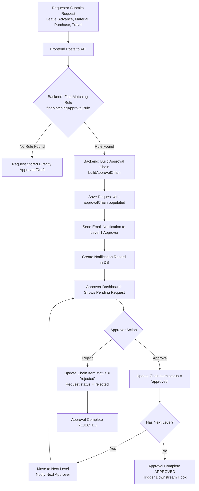
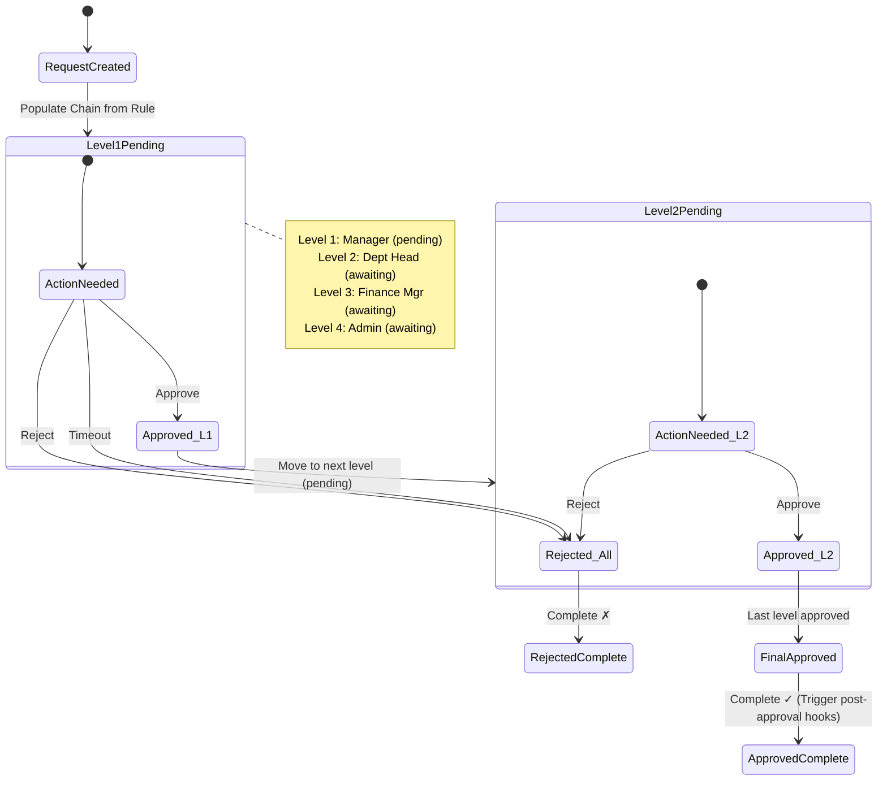
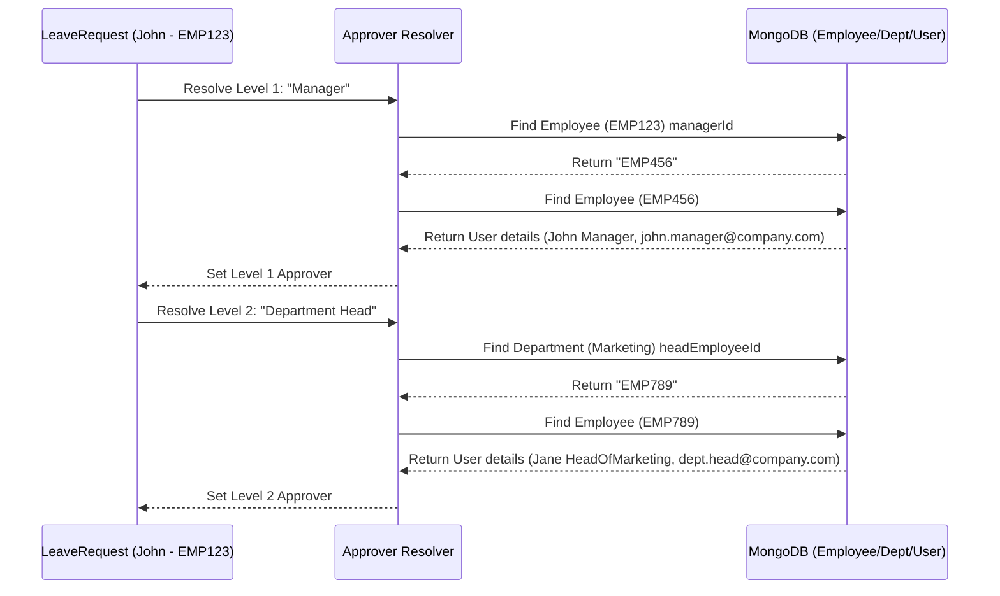
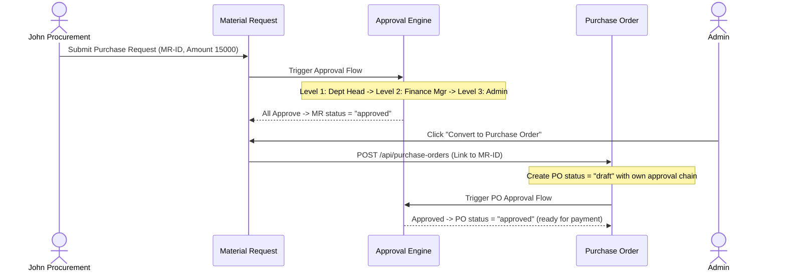
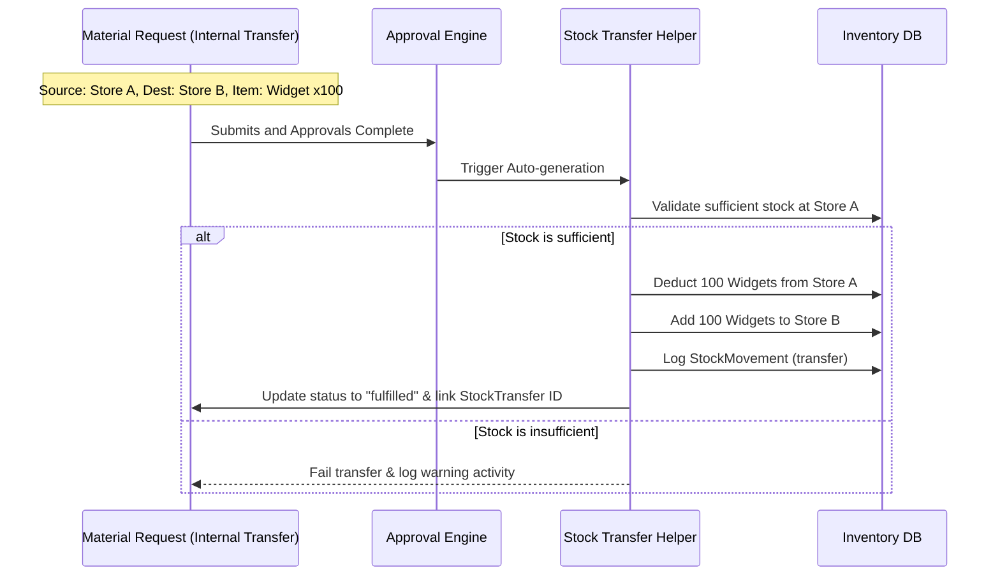
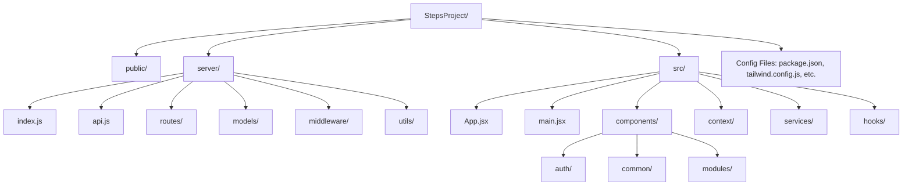
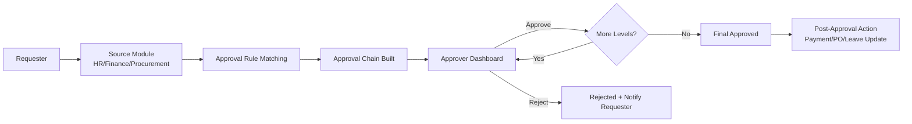
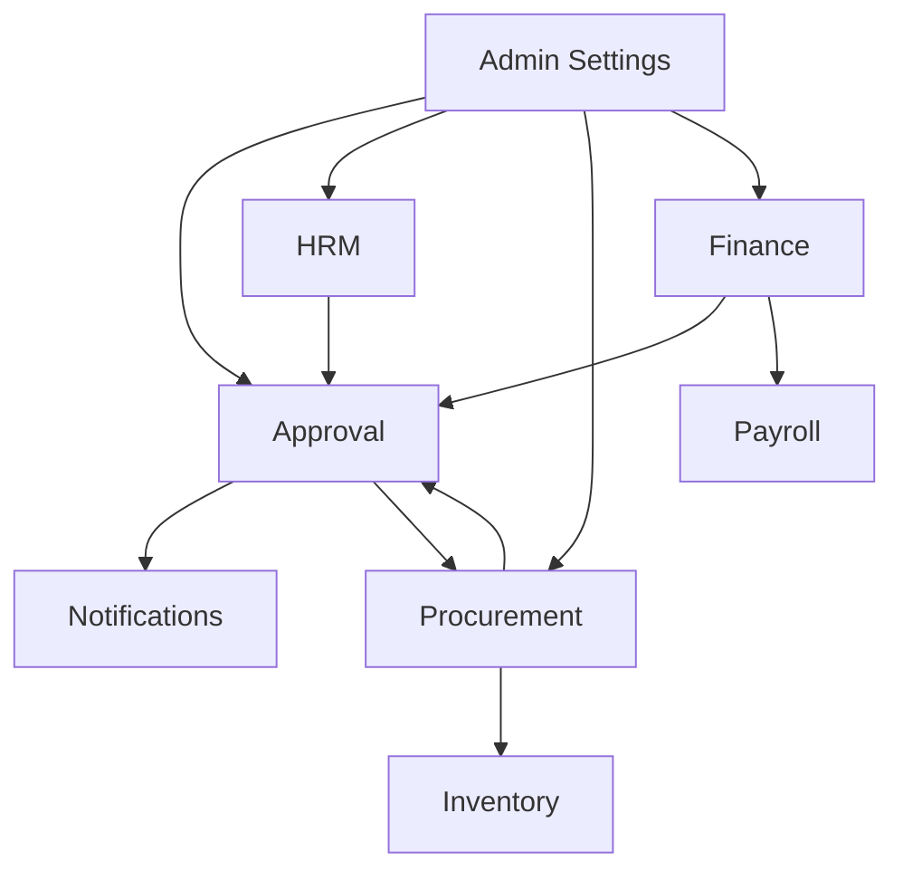
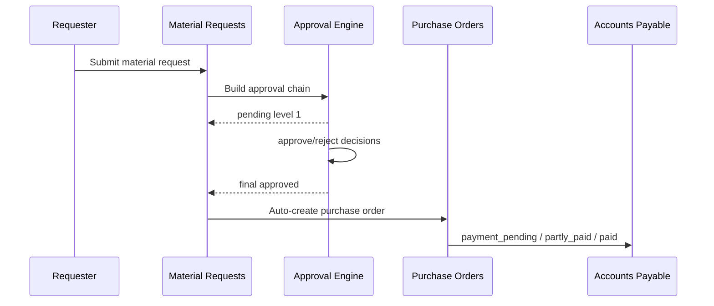

# Netlink CRM

Enterprise resource management platform built with React, Express, and MongoDB.

## Overview

Netlink CRM combines operations across HR, procurement, finance, payroll, inventory, maintenance, security, analytics, and admin controls in one system.

Current implementation highlights:

- Multi-module workspace with role-based access
- Approval workflow engine with configurable multi-level routing
- Material request to purchase order lifecycle support
- Direct purchase order creation and approval controls
- Accounts payable tracking including partial and full payment flow
- Centralized unit of measure setup used across Inventory, Material Requests, and Purchase Orders
- Notification center and activity timelines
- Audit-oriented admin capabilities

## Core Modules

- HRM: employees, departments, job titles, leave allocations, leave and travel requests
- Finance: invoicing, accounts payable, advance and refund requests
- Procurement: material requests, purchase orders, vendor management, stock-linked fulfillment
- Inventory: item management, unit setup, stock movements, internal transfers, issues
- Payroll: payroll run management and related workflows
- Attendance: attendance records and external attendance integration fallback
- Security: physical security logs, visitor sign-in, security settings
- Admin: module setup, users, roles, approval settings, backups, system settings
- Analytics and Reporting: consolidated operational dashboards and generated reports

## Unit of Measure Standardization (March 2026)

The platform now uses a single Unit Setup source for all quantity unit selection in Inventory, Material Requests, and Purchase Orders.

What changed:

- Admin users can create and manage units in Unit Setup (name, symbol, category, base quantity, base unit label, display order, active status).
- Inventory item create/update now accepts only active configured units (no free-text unit drift).
- Material Request line item unit options are fetched from Unit Setup.
- Purchase Order line item unit options are fetched from Unit Setup.
- Unit labels in request forms can show conversion context (example: `Carton (1 carton = 24 pcs)`).
- Unit Setup includes a live preview to confirm conversion intent before saving.

Field notes:

- `baseQuantity` and `baseUnitLabel` describe how one selected unit maps to its base unit.
- `displayOrder` controls list ordering in dropdowns and setup tables only; it does not affect calculations.
- `isActive=false` hides a unit from operational forms while preserving historical records.

Example conversion model:

- `Pack of 12`: name = Pack, baseQuantity = 12, baseUnitLabel = pcs
- `Carton of 24`: name = Carton, baseQuantity = 24, baseUnitLabel = pcs
- `Gallon of 50 liters`: name = Gallon, baseQuantity = 50, baseUnitLabel = liters

## Approval Workflow (Current Routing)

Approval rules are defined in the approval settings area and stored in the ApprovalRule model.

High-level flow:

1. Request is submitted from a source module (for example Material Requests, Leave Requests, Advance Requests).
2. Server matches an active rule for that module and condition set.
3. Server builds an approvalChain with level-based approvers.
4. Current approver sees the request as pending.
5. Approve action advances to next level or finalizes request.
6. Reject action stops the chain and marks request rejected.

Notable behavior in procurement:

- Material request final approval can trigger purchase order creation.
- Purchase orders also support their own approval chain and status progression.

## Approval Workflow Diagrams

#### 1) Request Submission to Approval Execution Flow


```mermaid
graph TD
    A[Requestor Submits Request<br>Leave, Advance, Material, Purchase, Travel] --> B[Frontend Posts to API]
    B --> C{Backend: Find Matching Rule<br>findMatchingApprovalRule}
    C -->|No Rule Found| D[Request Stored Directly Approved/Draft]
    C -->|Rule Found| E[Backend: Build Approval Chain<br>buildApprovalChain]
    E --> F[Save Request with approvalChain populated]
    F --> G[Send Email Notification to Level 1 Approver]
    G --> H[Create Notification Record in DB]
    H --> I[Approver Dashboard: Shows Pending Request]
    I --> J{Approver Action}
    J -->|Approve| K[Update Chain Item status = 'approved']
    J -->|Reject| L[Update Chain Item status = 'rejected'<br>Request status = 'rejected']
    K --> M{Has Next Level?}
    M -->|Yes| N[Move to Next Level<br>Notify Next Approver]
    N --> I
    M -->|No| O[Approval Complete APPROVED<br>Trigger Downstream Hook]
    L --> P[Approval Complete REJECTED]
```

### 2) Approval Chain Status Progression


```mermaid
stateDiagram-v2
    [*] --> RequestCreated
    RequestCreated --> Level1Pending: Populate Chain from Rule
    note right of Level1Pending
        Level 1: Manager (pending)
        Level 2: Dept Head (awaiting)
        Level 3: Finance Mgr (awaiting)
        Level 4: Admin (awaiting)
    end note
    
    state Level1Pending {
        [*] --> ActionNeeded
        ActionNeeded --> Approved_L1: Approve
        ActionNeeded --> Rejected_All: Reject
        ActionNeeded --> Rejected_All: Timeout
    }
    
    Rejected_All --> RejectedComplete: Complete ✗
    Approved_L1 --> Level2Pending: Move to next level (pending)
    
    state Level2Pending {
        [*] --> ActionNeeded_L2
        ActionNeeded_L2 --> Approved_L2: Approve
        ActionNeeded_L2 --> Rejected_All: Reject
    }
    
    Approved_L2 --> FinalApproved: Last level approved
    FinalApproved --> ApprovedComplete: Complete ✓ (Trigger post-approval hooks)
```

### 3) Module-Specific Approval Rules


```mermaid
graph TD
    subgraph Leave / Travel Requests Rule
        A[Leave/Travel Request] --> B{Resolver: Employee managerId}
        B --> C[Manager]
        C --> D[HR Director]
    end

    subgraph Advance / Refund Requests Rule
        E[Advance Request > 5000] --> F{Resolver: Employee managerId}
        F --> G[Manager]
        G --> H[Finance Manager]
        H --> I[Admin]
        I --> J[Post-Approval: Finance Processing / Payroll Deduction]
    end

    subgraph Material Requests Rule
        K[Material Request > 1000] --> L{Resolver: Dept Head}
        L --> M[Department Head]
        M --> N[Finance Manager]
        N --> O[Admin]
        O --> P{Request Type?}
        P -->|Internal Transfer| Q[Auto Stock Transfer / Update Inventory]
        P -->|Purchase Request| R[Convert to PO]
    end
```

### 4) Approver Resolution Logic


```mermaid
sequenceDiagram
    participant Request as LeaveRequest (John - EMP123)
    participant Solver as Approver Resolver
    participant DB as MongoDB (Employee/Dept/User)
    
    Request->>Solver: Resolve Level 1: "Manager"
    Solver->>DB: Find Employee (EMP123) managerId
    DB-->>Solver: Return "EMP456"
    Solver->>DB: Find Employee (EMP456)
    DB-->>Solver: Return User details (John Manager, john.manager@company.com)
    Solver-->>Request: Set Level 1 Approver
    
    Request->>Solver: Resolve Level 2: "Department Head"
    Solver->>DB: Find Department (Marketing) headEmployeeId
    DB-->>Solver: Return "EMP789"
    Solver->>DB: Find Employee (EMP789)
    DB-->>Solver: Return User details (Jane HeadOfMarketing, dept.head@company.com)
    Solver-->>Request: Set Level 2 Approver
```

### 5) Cross-Module Request Flow: Material Request to Purchase Order


```mermaid
sequenceDiagram
    actor Requester as John Procurement
    participant MR as Material Request
    participant Appr as Approval Engine
    participant PO as Purchase Order
    
    Requester->>MR: Submit Purchase Request (MR-ID, Amount 15000)
    MR->>Appr: Trigger Approval Flow
    Note over Appr: Level 1: Dept Head -> Level 2: Finance Mgr -> Level 3: Admin
    Appr-->>MR: All Approve -> MR status = "approved"
    
    actor Admin
    Admin->>MR: Click "Convert to Purchase Order"
    MR->>PO: POST /api/purchase-orders (Link to MR-ID)
    Note over PO: Create PO status = "draft" with own approval chain
    PO->>Appr: Trigger PO Approval Flow
    Appr-->>PO: Approved -> PO status = "approved" (ready for payment)
```

### 6) Internal Transfer to Auto Stock Transfer


```mermaid
sequenceDiagram
    participant MR as Material Request (Internal Transfer)
    participant Appr as Approval Engine
    participant Stock as Stock Transfer Helper
    participant Inv as Inventory DB
    
    Note over MR: Source: Store A, Dest: Store B, Item: Widget x100
    MR->>Appr: Submits and Approvals Complete
    Appr->>Stock: Trigger Auto-generation
    Stock->>Inv: Validate sufficient stock at Store A
    alt Stock is sufficient
        Stock->>Inv: Deduct 100 Widgets from Store A
        Stock->>Inv: Add 100 Widgets to Store B
        Stock->>Inv: Log StockMovement (transfer)
        Stock->>MR: Update status to "fulfilled" & link StockTransfer ID
    else Stock is insufficient
        Stock-->>MR: Fail transfer & log warning activity
    end
```

## Tech Stack

Frontend:

- React (Vite)
- React Router
- Tailwind CSS
- Axios-based API service
- React Hot Toast
- Recharts

Backend:

- Node.js and Express
- MongoDB with Mongoose
- JWT auth middleware
- Base64 encoded file storage in MongoDB

## Project Structure

```text
StepsProject/
   public/
   server/
      index.js
      api.js
      middleware/
      models/
      routes/
      utils/
   src/
      App.jsx
      main.jsx
      components/
         auth/
         common/
         modules/
      context/
      services/
      home/
      utils/
   package.json
   vite.config.js
   tailwind.config.js
   vercel.json
```

### Folder Structure Diagram


```mermaid
graph TD
    Root[StepsProject/] --> Public[public/]
    Root --> Server[server/]
    Root --> Src[src/]
    Root --> Config[Config Files: package.json, tailwind.config.js, etc.]
    
    Server --> SIndex[index.js]
    Server --> SApi[api.js]
    Server --> SRoutes[routes/]
    Server --> SModels[models/]
    Server --> SMiddleware[middleware/]
    Server --> SUtils[utils/]
    
    Src --> App[App.jsx]
    Src --> Main[main.jsx]
    Src --> Components[components/]
    Src --> Context[context/]
    Src --> Services[services/]
    Src --> Hooks[hooks/]
    
    Components --> Auth[auth/]
    Components --> Common[common/]
    Components --> Modules[modules/]
```

## Local Setup

Prerequisites:

- Node.js 18+
- npm
- MongoDB (local or Atlas)

1. Install dependencies in root and server:

```bash
npm install
cd server
npm install
cd ..
```

2. Create root .env:

```env
VITE_API_BASE_URL=http://localhost:4000
```

3. Create server/.env:

```env
MONGODB_URI=mongodb://localhost:27017/steps-crm
JWT_SECRET=change_me
JWT_REFRESH_SECRET=change_me_refresh
PORT=4000
INVENTORY_EXPIRY_ALERT_DAYS=30
INVENTORY_ALERT_EMAILS=ops@company.com,warehouse@company.com
```

4. Start backend:

```bash
cd server
npm run start
```

5. Start frontend in a second terminal:

```bash
npm run dev
```

Frontend default URL: http://localhost:5173

## Scripts

Root:

- npm run dev
- npm run build
- npm run preview
- npm run lint

Server:

- npm run start
- node seed.js

## API Surface (Selected)

Authentication:

- POST /api/auth/signup
- POST /api/auth/login
- GET /api/auth/verify
- POST /api/auth/forgot-password
- POST /api/auth/reset-password

Approval Settings:

- Base path: /api/approval-settings
- Managed by approval rule routes

Material Requests:

- GET /api/material-requests
- POST /api/material-requests
- POST /api/material-requests/:id/approve
- POST /api/material-requests/:id/reject
- POST /api/material-requests/:id/comments
- List endpoint returns paginated payloads for better performance on larger datasets

Purchase Orders:

- GET /api/purchase-orders
- GET /api/purchase-orders/:id
- POST /api/purchase-orders
- POST /api/purchase-orders/:id/approve
- POST /api/purchase-orders/:id/lock
- PUT /api/purchase-orders/:id

Material Request Workflow (RFQ -> PO -> Payment -> Receiving):

- POST /api/workflow/material-requests/:id/generate-rfq
- GET /api/workflow/rfqs
- GET /api/workflow/rfqs/:id
- POST /api/workflow/rfqs/:id/add-quotation
- POST /api/workflow/rfqs/:id/generate-po
- POST /api/workflow/pos/:id/record-payment
- GET /api/workflow/pos/:id/payments
- POST /api/workflow/pos/:id/receive-items
- GET /api/workflow/receipts
- GET /api/workflow/material-requests/:id/progress

Finance / AP:

- GET /api/finance/accounts-payable
- POST /api/purchase-orders/:id/mark-paid

Inventory / Unit Setup:

- GET /api/inventory/units
- POST /api/inventory/units
- PUT /api/inventory/units/:id
- DELETE /api/inventory/units/:id
- Inventory item create/update validates unit value against active Unit Setup records

Users and Notifications:

- GET /api/users
- GET /api/notifications
- PATCH /api/notifications/:id/read
- POST /api/notifications/clear-all

## API Examples

Use these examples as reference payloads for local testing.

### 1) Login

Request:

```http
POST /api/auth/login
Content-Type: application/json
```

```json
{
   "email": "admin@company.com",
   "password": "StrongPassword123!"
}
```

Response (success):

```json
{
   "success": true,
   "message": "Login successful",
   "data": {
      "user": {
         "_id": "65f0a1...",
         "fullName": "Admin User",
         "email": "admin@company.com",
         "role": "Admin",
         "status": "Active"
      },
      "token": "eyJhbGciOi..."
   }
}
```

### 2) Create Material Request

Request:

```http
POST /api/material-requests
Authorization: Bearer <token>
Content-Type: application/json
```

```json
{
   "requestType": "Purchase Request",
   "requestTitle": "Engineering Laptops",
   "requestedBy": "EMP00012",
   "department": "Engineering",
   "lineItems": [
      {
         "itemName": "Laptop",
         "quantity": 5,
         "quantityType": "pcs",
         "amount": 1250
      }
   ],
   "currency": "USD",
   "message": "Needed for onboarding Q2"
}
```

Response (success):

```json
{
   "message": "Request created and email sent",
   "data": {
      "_id": "65f0b2...",
      "requestId": "MR-03222026-001",
      "status": "pending",
      "approvalChain": [
         {
            "level": 1,
            "approverName": "Team Manager",
            "status": "pending"
         }
      ]
   }
}
```

### 3) Approve Material Request

Request:

```http
POST /api/material-requests/:id/approve
Authorization: Bearer <token>
Content-Type: application/json
```

```json
{
   "comment": "Approved for this sprint",
   "vendor": "Acme Supplies"
}
```

Response (example progression):

```json
{
   "success": true,
   "message": "Approval recorded and moved to next approver",
   "type": "approval_progress",
   "request": {
      "_id": "65f0b2...",
      "status": "pending",
      "currentApprovalLevel": 2
   }
}
```

Final-level approval can return a purchase order creation result depending on request type.

### 4) Create Purchase Order (Direct)

Request:

```http
POST /api/purchase-orders
Authorization: Bearer <token>
Content-Type: application/json
```

```json
{
   "requestTitle": "Office Internet Renewal",
   "vendor": "FiberNet Ltd",
   "expectedDelivery": "2026-04-10",
   "lineItems": [
      {
         "itemName": "Internet Subscription",
         "quantity": 1,
         "amount": 3500
      }
   ],
   "currency": "NGN",
   "notes": "Annual contract"
}
```

Response (success):

```json
{
   "_id": "65f0c3...",
   "poNumber": "PO-2026-042",
   "status": "draft",
   "vendor": "FiberNet Ltd",
   "totalAmount": 3500,
   "currency": "NGN"
}
```

### 5) Accounts Payable Query with Filters

Request:

```http
GET /api/finance/accounts-payable?vendor=FiberNet%20Ltd&status=payment_pending&dateRange=last30&minAmount=1000&page=1
Authorization: Bearer <token>
```

Response (success):

```json
{
   "success": true,
   "invoices": [
      {
         "_id": "65f0d4...",
         "poNumber": "PO-2026-042",
         "vendor": "FiberNet Ltd",
         "status": "payment_pending",
         "amount": 3500,
         "currency": "NGN"
      }
   ],
   "pagination": {
      "page": 1,
      "totalPages": 1,
      "total": 1
   }
}
```

## Architecture Diagrams

### A) Request Flow Across Modules


```mermaid
flowchart LR
   U[Requester] --> M[Source Module\nHR/Finance/Procurement]
   M --> R[Approval Rule Matching]
   R --> C[Approval Chain Built]
   C --> A[Approver Dashboard]
   A -->|Approve| N{More Levels?}
   A -->|Reject| X[Rejected + Notify Requester]
   N -->|Yes| A
   N -->|No| F[Final Approved]
   F --> P[Post-Approval Action\nPayment/PO/Leave Update]
```

### B) Module Interaction Overview


```mermaid
flowchart TB
   HR[HRM]
   FIN[Finance]
   PROC[Procurement]
   INV[Inventory]
   PAY[Payroll]
   APP[Approval]
   ADM[Admin Settings]
   NOTIF[Notifications]

   HR --> APP
   FIN --> APP
   PROC --> APP
   APP --> NOTIF
   APP --> PROC
   PROC --> INV
   FIN --> PAY
   ADM --> APP
   ADM --> HR
   ADM --> PROC
   ADM --> FIN
```

### C) Material Request to Purchase Order Lifecycle


```mermaid
sequenceDiagram
   participant Req as Requester
   participant MR as Material Requests
   participant AP as Approval Engine
   participant PO as Purchase Orders
   participant APV as Accounts Payable

   Req->>MR: Submit material request
   MR->>AP: Build approval chain
   AP-->>MR: pending level 1
   AP->>AP: approve/reject decisions
   AP-->>MR: final approved
   MR->>PO: Auto-create purchase order
   PO->>APV: payment_pending / partly_paid / paid
```

## Material Request Workflow (How To Use)

This is the current end-to-end procurement flow you can run in the app and by API.

1. Create and approve a Material Request.
2. Generate an RFQ from the approved request.
3. Add one or more vendor quotations.
4. Select a quotation and generate a PO.
5. Record payment (partial or full).
6. Receive items into inventory (allowed only after payment starts).
7. Track stage/progress from one endpoint.

### Stage Rules

- RFQ generation requires Material Request status = approved.
- PO generation requires at least one received quotation.
- Receiving requires PO status = partly_paid or paid.
- Receiving is blocked when PO status = payment_pending.

### Quick API Walkthrough

Use a valid token in all calls below.

1) Generate RFQ

```http
POST /api/workflow/material-requests/:materialRequestId/generate-rfq
Authorization: Bearer <token>
Content-Type: application/json
```

```json
{
   "vendorId": "<vendor-id>"
}
```

2) Add quotation

```http
POST /api/workflow/rfqs/:rfqId/add-quotation
Authorization: Bearer <token>
Content-Type: application/json
```

```json
{
   "quotedAmount": 350000,
   "quotedBy": "Acme Supplies",
   "notes": "Delivery in 5 days"
}
```

3) Generate PO from quotation

```http
POST /api/workflow/rfqs/:rfqId/generate-po
Authorization: Bearer <token>
Content-Type: application/json
```

```json
{
   "quotationIndex": 0
}
```

4) Record payment (partial or full)

```http
POST /api/workflow/pos/:poId/record-payment
Authorization: Bearer <token>
Content-Type: application/json
```

```json
{
   "amount": 150000,
   "paymentType": "partial",
   "paymentMethod": "bank_transfer"
}
```

5) Receive into inventory

```http
POST /api/workflow/pos/:poId/receive-items
Authorization: Bearer <token>
Content-Type: application/json
```

```json
{
   "receivedItems": [
      {
         "itemName": "Laptop",
         "quantityReceived": 5,
         "quantityType": "pcs",
         "condition": "excellent"
      }
   ],
   "storeLocation": {
      "locationName": "Main Warehouse"
   }
}
```

6) Check end-to-end progress

```http
GET /api/workflow/material-requests/:materialRequestId/progress
Authorization: Bearer <token>
```

### UI Entry Point

The workflow dashboard component is available in the frontend module:

- src/components/modules/MaterialRequestWorkflow.jsx

## Developer Quickstart

Common daily tasks for developers working on this repo.

### 1) Seed Data

```bash
cd server
node seed.js
```

Use this when bootstrapping a new local environment or restoring baseline module data.

### 2) Reset Local Database (MongoDB)

Option A: drop entire local database.

```bash
mongosh "mongodb://localhost:27017/steps-crm" --eval "db.dropDatabase()"
```

Then reseed:

```bash
cd server
node seed.js
```

Option B: clear specific collections only (safer for partial resets).

```bash
mongosh "mongodb://localhost:27017/steps-crm" --eval "db.materialrequests.deleteMany({}); db.purchaseorders.deleteMany({}); db.approvalrules.deleteMany({});"
```

### 3) Dev Run Checklist

```bash
# Terminal 1
cd server
npm run start

# Terminal 2
npm run dev
```

Verify:

- Backend health endpoint responds: GET /api/health
- Frontend loads at http://localhost:5173
- Login works and protected modules render

### 4) Manual Test Checklist (High Value)

- Auth:
   - Signup, login, token verification, logout
- Approval flow:
   - Submit request, approve level 1, approve final level, reject with reason
- Procurement:
   - Create material request, create direct PO, lock/unlock PO, PO approve/reject
- Finance/AP:
   - Filter AP list by status/date/amount, run partial payment then full payment
- Notifications:
   - Read single, clear all, verify badge updates
- Reporting:
   - Generate report and verify status transitions

### 5) Before Commit

- Run lint in root: npm run lint
- Smoke-test affected module pages
- Confirm no server startup errors in terminal logs

## Security Notes

- JWT-based authentication with protected routes
- Role-aware access controls for sensitive areas
- Password policy support and email verification flow
- Activity and audit logs for operational traceability

## Deployment

The repository includes vercel.json for deployment alignment.

Typical production steps:

1. Build frontend: npm run build
2. Configure environment variables in host platform
3. Deploy frontend and backend with matching API base URL and database credentials

## Contributing

1. Create a branch from main.
2. Keep changes scoped to one feature/fix.
3. Run lint and smoke-test impacted modules.
4. Open a pull request with clear testing notes.

## License

MIT. See LICENSE.

## Maintainer

Emmanuel Clef (EmmaDeil)

Last updated: March 22, 2026
